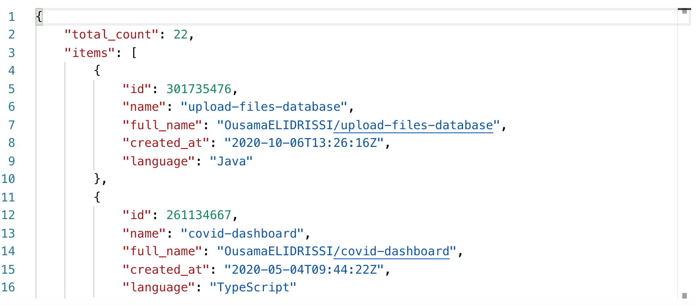
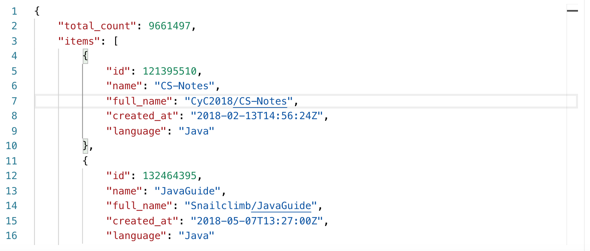

# Gemography Backend Coding Challenge

## APIs
For more details visit the following link after running the application: [Api Documentation link](http://localhost:9000/swagger-ui/index.html#/)

## Examples

### Get list of GitHub repositories by user name

#### API:
```
http://localhost:9000/github-repos/user/OusamaELIDRISSI
```
#### Result:



### Get list of GitHub repositories by language

#### API:
```
http://localhost:9000/github-repos/language/java
```
#### Result:


